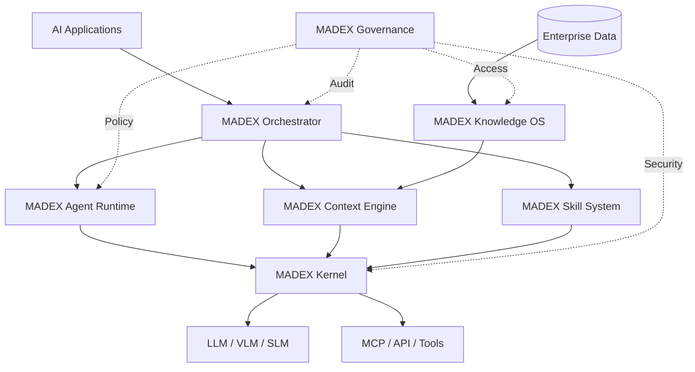

ใช่ครับ — ถ้าจะทำ **MADEX AI OS** ให้เป็นโครงการ Open Source ระยะยาว ผมแนะนำให้กำหนดโครงสร้างอย่างเป็นทางการว่า **MADEX ไม่ใช่ AI Agent Framework แต่เป็น AI Operating Platform** โดยมี 7 Core Systems เป็นแกนสถาปัตยกรรม

# MADEX AI OS

> **Open Source AI Operating Platform for Intelligent Agents**

**แนวคิดหลัก**

```text
                    MADEX AI OS
                         │
       ┌─────────────────┼─────────────────┐
       │                 │                 │
       ▼                 ▼                 ▼
  Intelligence       Knowledge          Execution
       │                 │                 │
       ▼                 ▼                 ▼
    Agents            Context          Orchestration
       │                 │                 │
       └─────────────────┼─────────────────┘
                         │
                    MADEX Kernel
                         │
       ┌─────────────────┼─────────────────┐
       ▼                 ▼                 ▼
    Models             Tools             Data
                         │
                    Governance
```

## 1. MADEX Kernel

**หัวใจของระบบ**

ทำหน้าที่เป็น Runtime Core ของ MADEX AI OS

```text
MADEX Kernel
├── Model Runtime
├── Agent Runtime Interface
├── Context Runtime
├── Memory Runtime
├── Tool Runtime
├── Event Runtime
└── Security Runtime
```

หน้าที่สำคัญคือทำให้ระบบด้านบนไม่ต้องผูกติดกับ LLM หรือ Provider รายใดรายหนึ่ง

```text
Application
     ↓
MADEX API
     ↓
MADEX Kernel
     ↓
┌────┼────┬────┐
GPT Claude Gemini Qwen Local
```

---

# 2. MADEX Agent Runtime

เป็น **Execution Environment สำหรับ AI Agent**

Agent จะมี lifecycle เช่น

```text
REQUEST
   ↓
UNDERSTAND
   ↓
REASON
   ↓
PLAN
   ↓
ACT
   ↓
OBSERVE
   ↓
VERIFY
   ↓
RESPOND
```

รองรับ

* Single Agent
* Multi-Agent
* Supervisor Agent
* Autonomous Agent
* Human-in-the-loop
* Agent-to-Agent

ตัวอย่าง:

```yaml
agent:
  name: research-agent
  role: researcher

  model:
    provider: auto

  skills:
    - web-search
    - rag
    - document-analysis

  memory:
    - episodic
    - semantic

  permissions:
    database: read
```

---

# 3. MADEX Context Engine

ส่วนนี้ควรเป็น **Core Technology ของ MADEX**

เพราะปัญหาสำคัญของ Agent ไม่ใช่แค่การเลือก LLM แต่คือ

> **Agent จะรู้ได้อย่างไรว่าควรนำข้อมูลอะไรเข้า Context**

Architecture:

```text
User Question
      ↓
Question Relevance Filter
      ↓
Clean Question
      ↓
Question Analysis
      ↓
Context Retrieval
      ├── RAG
      ├── Memory
      ├── Knowledge Graph
      └── External Data
      ↓
Context Ranking
      ↓
Context Assembly
      ↓
LLM / Agent
```

ดังนั้น MADEX สามารถมีแนวคิด

**Context Engineering as Infrastructure**

ไม่ใช่เพียง Prompt Engineering

---

# 4. MADEX Knowledge OS

เปลี่ยนข้อมูลขององค์กรให้กลายเป็น Knowledge ที่ Agent ใช้งานได้

```text
Data
 │
 ├── Documents
 ├── Database
 ├── API
 ├── Web
 ├── Images
 ├── Audio
 └── Video
       │
       ▼
   Ingestion
       ↓
   Processing
       ↓
   Embedding
       ↓
 ┌─────┴─────┐
 ▼           ▼
Vector      Graph
Search      Knowledge
 └─────┬─────┘
       ▼
Semantic Knowledge
```

รองรับ

* RAG
* Vector Search
* Hybrid Search
* Reranking
* Knowledge Graph
* Semantic Search
* Multimodal Knowledge

---

# 5. MADEX Orchestrator

เป็น **สมองด้านการประสานงาน**

```text
User
 ↓
AI Router
 ↓
Planner
 ↓
Task Decomposition
 ↓
Agent Selection
 ↓
Workflow
 ↓
Execution
 ↓
Verification
 ↓
Final Result
```

ตัวอย่าง

```text
User:
"วิเคราะห์ยอดขายไตรมาสนี้และเสนอแนวทางแก้ไข"

                ↓

          MADEX Router

       ┌────────┼────────┐
       ↓        ↓        ↓
 Data Agent  Research  Analyst
       │        Agent      │
       └────────┼──────────┘
                ↓
          Decision Agent
                ↓
            Verification
                ↓
              Report
```

---

# 6. MADEX Skill System

ทำให้ความสามารถของ Agent เป็น **Composable Skills**

แทนที่จะสร้าง Agent ใหม่ทุกครั้ง

```text
Agent
 │
 ├── Search Skill
 ├── SQL Skill
 ├── RAG Skill
 ├── Python Skill
 ├── Coding Skill
 ├── Vision Skill
 ├── Document Skill
 └── Decision Skill
```

สามารถติดตั้ง Skill:

```bash
madex skill install rag
madex skill install sql
madex skill install python
madex skill install web-search
```

แนวคิดนี้สามารถนำไปสู่ **MADEX Skill Marketplace** ได้ในอนาคต

---

# 7. MADEX Governance

สำหรับ Enterprise AI ส่วนนี้สำคัญมาก

```text
Identity
   ↓
Authentication
   ↓
Authorization
   ↓
Policy
   ↓
Agent
   ↓
Tool
   ↓
Action
   ↓
Audit
```

ประกอบด้วย

* Identity
* RBAC / ABAC
* Agent Permission
* Tool Permission
* Data Permission
* Policy Engine
* Audit Log
* Human Approval
* AI Safety
* Model Governance
* Evaluation
* Observability

ตัวอย่าง:

```yaml
policy:
  agent: finance-agent

  database:
    read: true
    write: false

  payment:
    execute: false

  report:
    create: true

  approval:
    required: true
```

---

# 8. ทั้ง 7 ระบบเชื่อมกันอย่างไร



---

# 9. MADEX AI OS Stack

ผมจะจัด Layer ของระบบแบบนี้:

| Layer             | MADEX Component            |
| ----------------- | -------------------------- |
| **Application**   | MADEX Apps                 |
| **Intelligence**  | Agent Runtime              |
| **Orchestration** | Orchestrator               |
| **Context**       | Context Engine             |
| **Knowledge**     | Knowledge OS               |
| **Capability**    | Skill System               |
| **Execution**     | Kernel                     |
| **Integration**   | MCP / API / Tools          |
| **Model**         | LLM / VLM / SLM            |
| **Data**          | Database / Files / Streams |
| **Governance**    | Security / Policy / Audit  |

---

# 10. MADEX AI OS กับระบบเดิม

ความแตกต่างจะชัดมาก:

```text
Traditional AI Application

Application
     ↓
Prompt
     ↓
LLM
     ↓
Answer
```

```text
AI Agent Framework

Application
     ↓
Agent
     ↓
LLM
     ↓
Tools
```

แต่

```text
MADEX AI OS

Application
      ↓
MADEX Orchestrator
      ↓
Agent Runtime
      ↓
Context Engine
      ↓
Knowledge OS
      ↓
Memory
      ↓
Skill System
      ↓
MADEX Kernel
      ↓
Model Runtime
      ↓
Tools / MCP / Data
      ↓
Governance
      ↓
Action
```

นี่คือจุดที่ทำให้ **MADEX เป็น Platform มากกว่า Framework**

---

# 11. MADEX Development Roadmap

ผมแนะนำให้ไม่สร้างทั้ง 7 ระบบพร้อมกัน แต่พัฒนาเป็นระยะ

### Phase 1 — MADEX Kernel

```text
Model Adapter
Agent Interface
Tool Interface
Event System
Configuration
```

### Phase 2 — Agent Runtime

```text
Agent
Memory
Reasoning
Planning
Execution
Verification
```

### Phase 3 — Context Engine

```text
Question Filter
Context Retrieval
Context Ranking
Context Assembly
```

### Phase 4 — Knowledge OS

```text
Ingestion
Embedding
Vector Search
RAG
Knowledge Graph
```

### Phase 5 — Orchestrator

```text
Router
Planner
Workflow
Multi-Agent
A2A
```

### Phase 6 — Skill System

```text
Skill SDK
Skill Registry
Skill Marketplace
```

### Phase 7 — Governance

```text
Identity
Permission
Policy
Audit
Evaluation
Observability
```

---

# 12. วิสัยทัศน์ของ MADEX

สุดท้าย MADEX ควรไปถึงจุดนี้:

```text
                    MADEX AI OS
                         │
          ┌──────────────┼──────────────┐
          │              │              │
       KNOWLEDGE       AGENTS        SKILLS
          │              │              │
          └──────────────┼──────────────┘
                         │
                  INTELLIGENCE
                         │
                  ORCHESTRATION
                         │
                    AI KERNEL
                         │
          ┌──────────────┼──────────────┐
          │              │              │
        MODELS         TOOLS           DATA
          │              │              │
          └──────────────┼──────────────┘
                         │
                    GOVERNANCE
```

### Core Philosophy

> **MADEX does not build one AI Agent.
> MADEX provides the operating environment in which thousands of AI Agents can live, learn, collaborate, use tools, access knowledge, make decisions, and operate safely.**

นี่เป็น Positioning ที่ผมคิดว่าแข็งแรงมากสำหรับโครงการ Open Source เพราะ **MADEX สามารถเป็น “AI OS” ที่อยู่เหนือ LLM และอยู่ใต้ AI Applications** ได้ แทนที่จะต้องแข่งขันตรง ๆ กับ Framework อย่าง LangGraph, CrewAI หรือ AutoGen.
