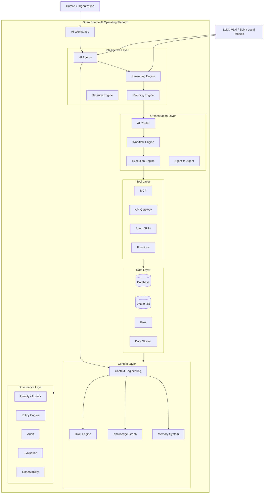
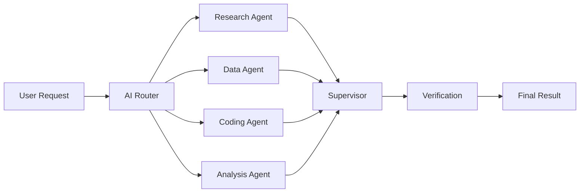

## Open Source AI Operating Platform

แนวคิดนี้สามารถยกระดับจาก **AI Agent Framework** ไปเป็น **AI Operating Platform** ได้ โดยมองว่าเป็น “ระบบปฏิบัติการสำหรับ AI” ที่จัดการตั้งแต่ **Model → Agent → Knowledge → Memory → Tool → Workflow → Data → Governance → Action**

### นิยาม

> **Open Source AI Operating Platform (OSAOP)** คือแพลตฟอร์มโอเพนซอร์สที่ทำหน้าที่เป็นโครงสร้างพื้นฐานกลางสำหรับสร้าง รัน เชื่อมต่อ ควบคุม และบริหาร AI Agents และ AI Applications ภายในองค์กร

---

## 1. Architecture



---

# 2. เปรียบเทียบกับ AI Agent Framework

| AI Agent Framework   | AI Operating Platform     |
| -------------------- | ------------------------- |
| สร้าง Agent          | สร้างและบริหาร Agent      |
| เรียก LLM            | จัดการหลาย Model          |
| Tool Calling         | Tool + MCP + API          |
| Workflow             | Workflow + Orchestration  |
| Memory               | Enterprise Memory         |
| RAG                  | Knowledge Infrastructure  |
| Agent                | Multi-Agent System        |
| Application          | AI Application Platform   |
| ไม่มี Governance ครบ | Identity + Policy + Audit |
| Developer-centric    | Organization-centric      |

จุดเปลี่ยนสำคัญคือ

> **จาก “สร้าง Agent” → “บริหารระบบนิเวศของ AI ทั้งองค์กร”**

---

# 3. AI Operating System Model

ผมแนะนำให้กำหนด OS ออกเป็น 7 ระบบหลัก

### 01 — AI Kernel

หัวใจของ Platform

```text
AI Kernel
├── Model Runtime
├── Agent Runtime
├── Context Runtime
├── Memory Runtime
└── Tool Runtime
```

ทำหน้าที่เหมือน Kernel ของ Operating System

---

### 02 — Agent Runtime

เป็น execution environment สำหรับ Agent

```text
Agent
 ↓
Observe
 ↓
Think
 ↓
Plan
 ↓
Act
 ↓
Verify
 ↓
Learn
```

รองรับ

* Single Agent
* Multi-Agent
* Supervisor Agent
* Autonomous Agent
* Human-in-the-loop

---

### 03 — Context Engine

ระบบจัดการ Context โดยเฉพาะ

```text
Question
   ↓
Question Filter
   ↓
Clean Question
   ↓
Context Retrieval
   ↓
Memory Retrieval
   ↓
Knowledge Retrieval
   ↓
Context Assembly
   ↓
LLM
```

ส่วนนี้สามารถเป็นหนึ่งใน **Core Technology ของ MADEX** ได้ดีมาก

---

### 04 — Knowledge OS

เปลี่ยนข้อมูลดิบให้เป็น Knowledge

```text
Data
 ↓
Ingestion
 ↓
Processing
 ↓
Embedding
 ↓
Vector Index
 ↓
Knowledge Graph
 ↓
Semantic Knowledge
```

รองรับ

```text
Documents
Databases
APIs
Web
Images
Video
Audio
Enterprise Systems
```

---

### 05 — Agent Orchestration

ควบคุม Agent หลายตัว



---

# 4. AI System Bus

แนวคิดที่น่าสนใจมากสำหรับ AI OS คือ **AI System Bus**

เปรียบเทียบกับ Computer OS:

```text
Computer OS

Application
     ↓
System API
     ↓
Kernel
     ↓
Hardware
```

AI OS:

```text
AI Application
     ↓
Agent API
     ↓
AI Kernel
     ↓
Model / Data / Tools
```

ดังนั้น Application ไม่จำเป็นต้องผูกกับ Model ใด Model หนึ่ง

```text
                 AI Application
                       │
                  Agent API
                       │
                  AI Kernel
                       │
        ┌──────────────┼──────────────┐
        ↓              ↓              ↓
      OpenAI         Gemini         Qwen
        ↓              ↓              ↓
      Tools          MCP            Local
```

นี่จะทำให้ Platform เป็น **Model-agnostic**

---

# 5. AI Hardware Abstraction

อีกแนวคิดที่สำคัญคือ

> **Model Abstraction Layer**

Application ไม่ควรต้องรู้ว่าใช้ Model อะไร

```yaml
agent:
  name: research-agent

model:
  provider: auto
  capability:
    reasoning: high
    context: large
    vision: false
```

Router สามารถเลือก Model ให้เอง

```text
Request
   ↓
Capability Detection
   ↓
Model Router
   ├── GPT
   ├── Claude
   ├── Gemini
   ├── Qwen
   └── Local LLM
```

---

# 6. AI Package Manager

ถ้าจะทำให้เป็น “Operating Platform” จริง ควรมีแนวคิดคล้าย `npm`, `pip` หรือ `apt`

เช่น

```bash
madex install research-agent
madex install sql-agent
madex install rag-agent
madex install coding-agent
```

หรือ

```bash
madex install skill:web-search
madex install skill:database
madex install skill:python
madex install skill:document
```

ทำให้เกิด

> **Agent Ecosystem**

---

# 7. AI Skill System

Agent ไม่ควรมีความสามารถทุกอย่างในตัวเอง

แต่ใช้

```text
Agent
 │
 ├── Skill: Search
 ├── Skill: RAG
 ├── Skill: SQL
 ├── Skill: Python
 ├── Skill: Coding
 ├── Skill: Vision
 └── Skill: Planning
```

ดังนั้น Agent สามารถประกอบความสามารถแบบ Modular ได้

---

# 8. AI Governance

สำหรับระดับองค์กร ต้องมี

```text
Identity
   ↓
Permission
   ↓
Policy
   ↓
Agent
   ↓
Tool
   ↓
Action
   ↓
Audit
```

ตัวอย่าง:

```yaml
agent: finance-agent

permissions:
  database:
    read: true
    write: false

  payment:
    execute: false

  reports:
    create: true

approval:
  required: true
```

ทำให้ Agent ไม่สามารถทำทุกอย่างตามใจได้

---

# 9. Open Source Stack

Architecture สามารถใช้ Open Source เป็นหลัก:

```text
Frontend
    Next.js
    React

API
    FastAPI
    Node.js

Agent Runtime
    Python
    LangGraph

LLM
    Ollama
    vLLM
    Qwen
    Llama

Vector
    Qdrant
    pgvector

Graph
    Neo4j

Database
    PostgreSQL

Workflow
    Temporal
    Celery

Integration
    MCP

Observability
    OpenTelemetry

Infrastructure
    Docker
    Kubernetes
```

โดยสามารถเชื่อม Commercial Model ได้ด้วย

```text
Open Source
      +
Commercial AI Models
      +
Local Models
      =
Hybrid AI Platform
```

---

# 10. Project Structure

ถ้าพัฒนาเป็นโครงการจริง ผมแนะนำชื่อ repository ประมาณ:

```text
madex-ai-os/
│
├── kernel/
│   ├── model-runtime/
│   ├── agent-runtime/
│   ├── context-runtime/
│   ├── memory-runtime/
│   └── tool-runtime/
│
├── agents/
│   ├── registry/
│   ├── runtime/
│   ├── supervisor/
│   └── marketplace/
│
├── intelligence/
│   ├── reasoning/
│   ├── planning/
│   └── decision/
│
├── context/
│   ├── rag/
│   ├── retrieval/
│   ├── reranker/
│   └── context-engine/
│
├── knowledge/
│   ├── vector/
│   ├── graph/
│   └── semantic/
│
├── memory/
│   ├── working/
│   ├── episodic/
│   ├── semantic/
│   └── procedural/
│
├── orchestration/
│   ├── router/
│   ├── workflow/
│   ├── executor/
│   └── a2a/
│
├── skills/
│
├── tools/
│   ├── mcp/
│   ├── api/
│   └── functions/
│
├── governance/
│   ├── identity/
│   ├── policy/
│   ├── audit/
│   └── evaluation/
│
├── sdk/
├── cli/
├── studio/
├── docs/
└── examples/
```

## 11. Vision

ภาพใหญ่ที่สุดของโครงการสามารถสรุปได้ว่า

```text
                 HUMAN
                   │
                   ▼
            AI APPLICATION
                   │
                   ▼
             AGENT PLATFORM
                   │
        ┌──────────┼──────────┐
        ▼          ▼          ▼
      AGENT      SKILL       WORKFLOW
        │          │          │
        └──────────┼──────────┘
                   ▼
              AI KERNEL
                   │
     ┌─────────────┼─────────────┐
     ▼             ▼             ▼
   MODELS        KNOWLEDGE      TOOLS
     │             │             │
     ▼             ▼             ▼
   LLM/VLM       RAG/GRAPH       MCP
                   │
                   ▼
                 DATA
```

### Positioning ที่ผมคิดว่าแข็งแรงที่สุด

**MADEX — Open Source AI Operating Platform**

> **Build. Run. Connect. Govern AI Agents.**

หรือภาษาไทย:

> **แพลตฟอร์มโอเพนซอร์สสำหรับสร้าง รัน เชื่อมต่อ และควบคุมระบบ AI Agents ตั้งแต่ระดับ Model จนถึงระดับองค์กร**

และถ้าจะพัฒนาให้เป็นโครงการขนาดใหญ่จริง ๆ ผมจะวาง **MADEX AI OS** เป็นแกนกลาง แล้วแตกออกเป็น **MADEX Kernel, MADEX Agent Runtime, MADEX Context Engine, MADEX Knowledge OS, MADEX Orchestrator, MADEX Skill System และ MADEX Governance** ซึ่งจะทำให้แนวคิดนี้มีโครงสร้างชัดเจนกว่าแค่ “Framework สำหรับสร้าง AI Agent” มากครับ
