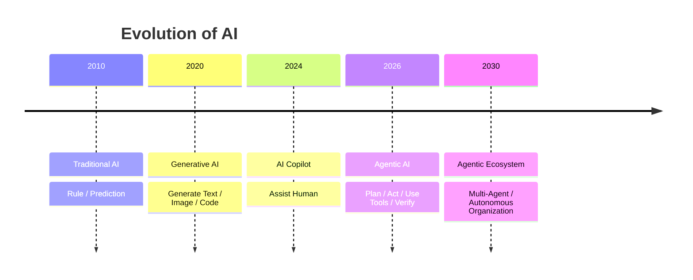
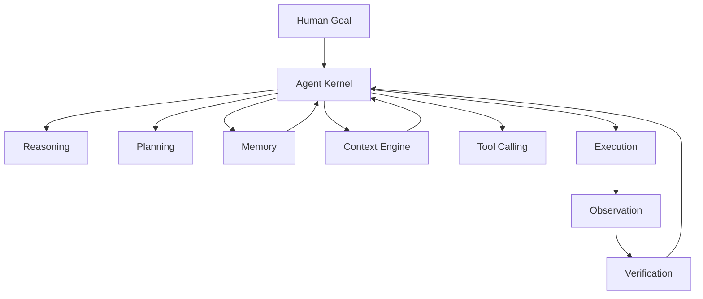
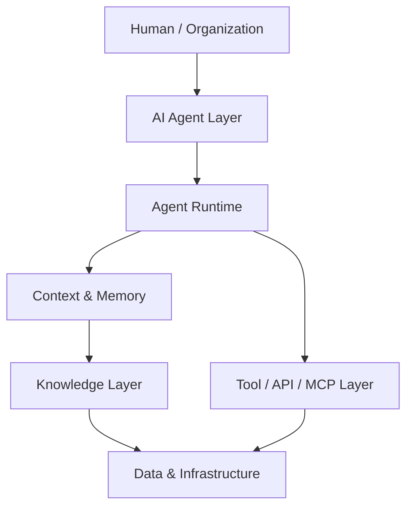
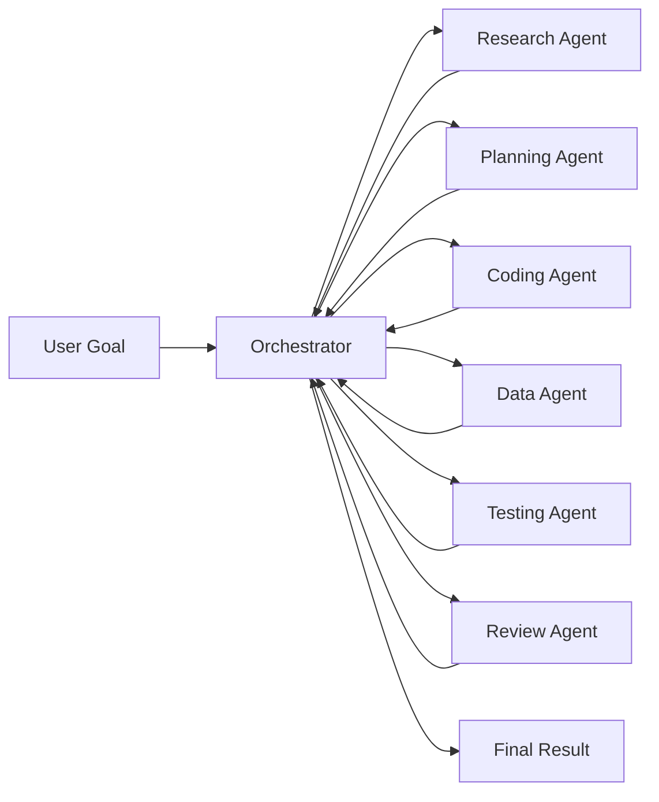
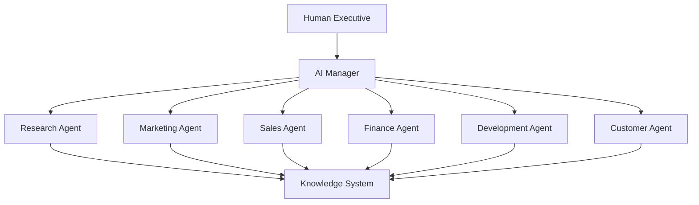
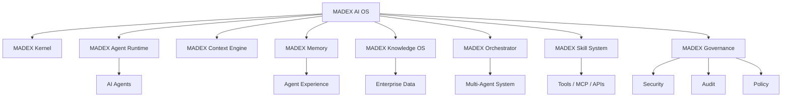
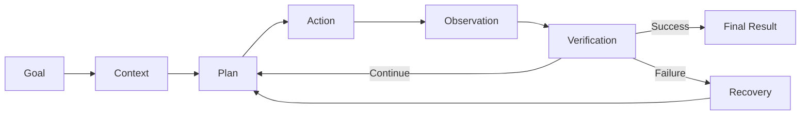

# Agentic Era

**Agentic Era** หรือ **ยุคแห่ง AI Agents** คือยุคที่ AI ก้าวจากการเป็นเพียง “เครื่องมือที่ตอบคำถาม” ไปสู่การเป็น **ระบบที่สามารถคิด วางแผน ตัดสินใจ ใช้เครื่องมือ ลงมือทำ และเรียนรู้จากผลลัพธ์** เพื่อบรรลุเป้าหมายที่ได้รับมอบหมาย

พูดง่าย ๆ คือ

> **จาก AI ที่ “ตอบ” → สู่ AI ที่ “ทำงาน” → สู่ AI ที่ “บริหารกระบวนการ”**

## 1. จาก Generative AI สู่ Agentic AI

วิวัฒนาการของ AI สามารถมองได้เป็น 4 ระยะ

### Traditional AI

AI ทำงานตามโมเดลหรือกฎที่กำหนดไว้

**Input → Model → Output**

### Generative AI

AI สามารถสร้างเนื้อหาใหม่ได้

**Prompt → LLM → Content**

เช่น

* เขียนบทความ
* เขียน Code
* สรุปเอกสาร
* สร้างภาพ
* วิเคราะห์ข้อมูล

### AI Copilot

AI เริ่มทำงานร่วมกับมนุษย์

**Human → AI → Human Decision**

AI ช่วยเสนอคำตอบ แต่โดยทั่วไปมนุษย์ยังเป็นผู้ควบคุมหลัก

### Agentic AI

AI สามารถรับ **Goal** แล้วแตกงานและดำเนินการหลายขั้นตอนได้

**Goal → Plan → Act → Observe → Verify → Complete**

---

# 2. Agentic AI คืออะไร?

หัวใจของ Agentic AI ไม่ใช่แค่ LLM

แต่คือการนำหลายองค์ประกอบมาประกอบกันเป็น **ระบบปฏิบัติการสำหรับการทำงานของ AI**

ดังนั้น Agent จึงสามารถมีวงจรลักษณะ

**Think → Plan → Act → Observe → Verify → Learn**

---

# 3. Agentic Era เปลี่ยนอะไร?

สิ่งที่เปลี่ยนสำคัญที่สุดคือ **หน่วยของการทำงาน**

ยุคเดิม:

> คนใช้ Software

ยุค Generative AI:

> คนถาม AI

ยุค Agentic:

> **คนมอบหมายงานให้ AI**

ตัวอย่างเช่น

### แบบเดิม

> “เขียนรายงานเกี่ยวกับ AI Agent”

AI สร้างเนื้อหาให้

### แบบ Agentic

> “ศึกษาตลาด AI Agent วิเคราะห์คู่แข่ง สรุปเทคโนโลยีที่สำคัญ และจัดทำรายงานสำหรับผู้บริหาร”

Agent สามารถ:

1. วิเคราะห์โจทย์
2. แบ่งงาน
3. ค้นข้อมูล
4. อ่านเอกสาร
5. วิเคราะห์ข้อมูล
6. ใช้เครื่องมือ
7. ตรวจสอบผลลัพธ์
8. สร้างรายงาน
9. ส่งผลลัพธ์กลับมา

นี่คือความแตกต่างระหว่าง **Generation** กับ **Agency**

---

# 4. Agentic Era Architecture

สามารถมอง Agentic Era เป็น Stack ใหม่ของ Computing ได้

องค์ประกอบสำคัญคือ

| Layer          | หน้าที่                         |
| -------------- | ------------------------------- |
| Human          | กำหนดเป้าหมาย                   |
| Agent          | Reasoning / Planning / Decision |
| Runtime        | ควบคุมการทำงาน                  |
| Context        | จัดการบริบท                     |
| Memory         | เก็บประสบการณ์                  |
| Knowledge      | เข้าถึงความรู้                  |
| Tools          | เชื่อมต่อโลกภายนอก              |
| Data           | ข้อมูลขององค์กร                 |
| Infrastructure | Compute / Storage / Network     |

---

# 5. จาก AI Agent → Agentic System

จุดสำคัญของ Agentic Era คือ **เราไม่ได้สร้าง Agent เพียงตัวเดียว**

แต่สร้างระบบที่มี Agent หลายประเภท

จึงเกิดแนวคิด

**Multi-Agent System**

และต่อยอดไปสู่

**Agentic Organization**

---

# 6. Agentic Organization

ในอนาคต AI Agent อาจไม่ได้เป็นเพียงผู้ช่วยส่วนบุคคล แต่สามารถกลายเป็น **Digital Workforce**

ตัวอย่างเช่น

องค์กรจึงเปลี่ยนจาก

> **Human + Software**

เป็น

> **Human + AI Agents + Software + Data**

---

# 7. MADEX ใน Agentic Era

แนวคิด **MADEX AI OS** ที่คุณกำลังพัฒนา สามารถวางตำแหน่งได้ค่อนข้างชัดเจนในยุคนี้ เพราะไม่จำเป็นต้องเป็นเพียง Framework สำหรับสร้าง Agent แต่สามารถพัฒนาเป็น **Agentic Operating Platform**

โครงสร้างสามารถกำหนดเป็น

จุดแข็งของแนวคิดนี้คือ **MADEX ไม่ได้มอง Agent เป็นแค่ Prompt + LLM**

แต่กำลังมอง Agent เป็น **Computing Entity** ที่มี

> **Identity + Context + Memory + Knowledge + Skills + Tools + Reasoning + Execution + Governance**

---

# 8. Core Loop ของ Agentic Era

หัวใจของระบบ Agentic คือ **Agent Loop**

นี่เป็นสิ่งที่ทำให้ Agent แตกต่างจาก Chatbot อย่างชัดเจน

**Chatbot**

> Input → Output

**Agent**

> Goal → Reason → Plan → Act → Observe → Verify → Repeat

---

# 9. เทคโนโลยีสำคัญของ Agentic Era

ระบบ Agentic จะประกอบด้วยเทคโนโลยีหลายกลุ่ม เช่น

* LLM / Reasoning Models
* AI Agent
* Multi-Agent
* RAG
* Agent Memory
* Context Engineering
* MCP
* A2A
* Tool Calling
* Function Calling
* Workflow Engine
* Graph Execution
* AI Router
* Knowledge Graph
* Vector Database
* Long-Term Memory
* Agent Evaluation
* Agent Governance
* Human-in-the-Loop

ดังนั้น **Agentic Engineering** จึงกำลังกลายเป็นศาสตร์ที่กว้างกว่า Prompt Engineering มาก

---

# 10. Paradigm Shift

สรุปการเปลี่ยนแปลงของยุคนี้ได้ดังนี้

| ยุค                  | AI ทำอะไร   |
| -------------------- | ----------- |
| Traditional AI       | Predict     |
| Machine Learning     | Learn       |
| Generative AI        | Generate    |
| Copilot              | Assist      |
| AI Agent             | Act         |
| Multi-Agent          | Collaborate |
| Agentic System       | Execute     |
| Agentic Organization | Operate     |

และอาจสรุปเป็นประโยคเดียวว่า:

> **The Agentic Era is the transition from AI that generates answers to AI systems that pursue goals and execute work.**

ในมุมของ **MADEX AI OS** แนวคิดที่น่าสนใจที่สุดจึงไม่ใช่การสร้าง “AI Agent อีกหนึ่งตัว” แต่คือการสร้าง **โครงสร้างพื้นฐานที่ทำให้ Agent จำนวนมากสามารถคิด ทำงาน ใช้เครื่องมือ จดจำ เรียนรู้ สื่อสาร และอยู่ภายใต้ Governance เดียวกันได้** — ซึ่งตรงกับแนวคิด **AI Operating System for the Agentic Era** อย่างมาก.
