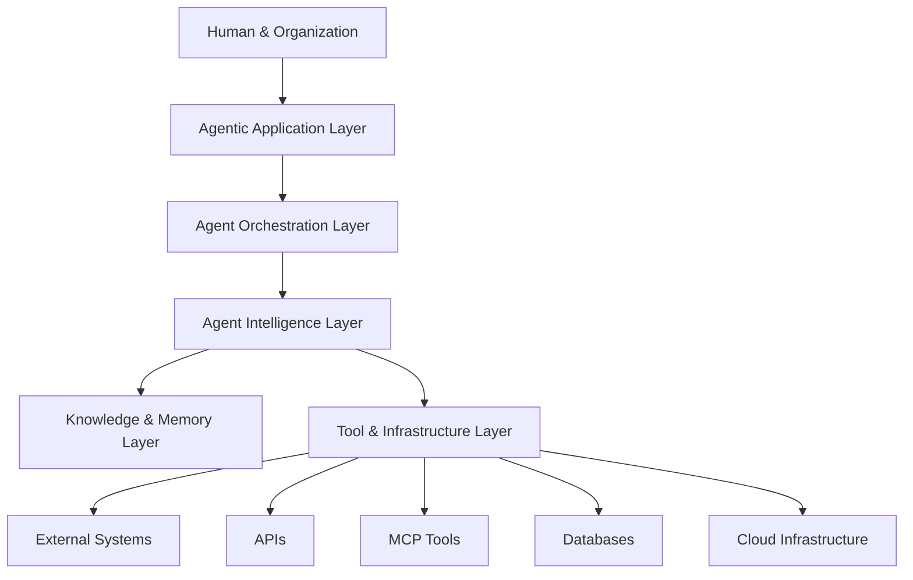
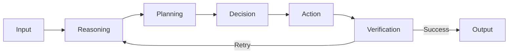
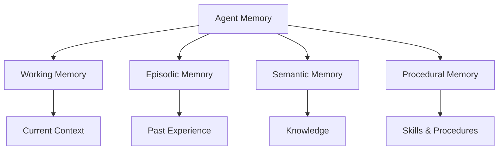
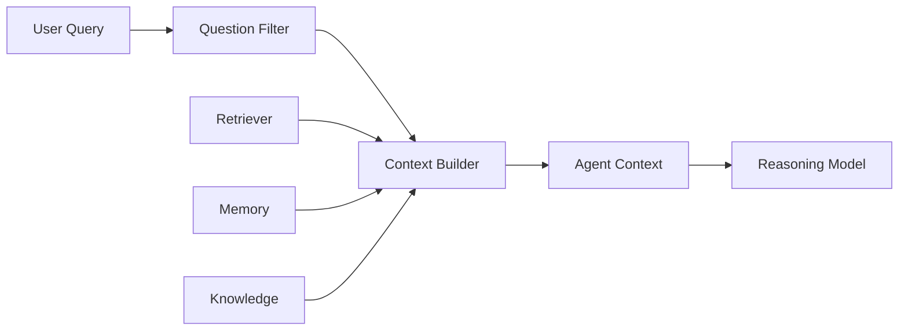
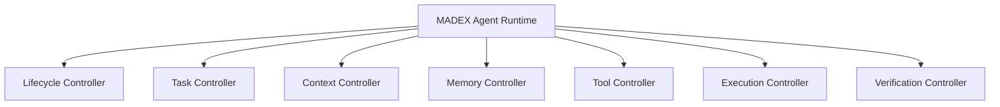
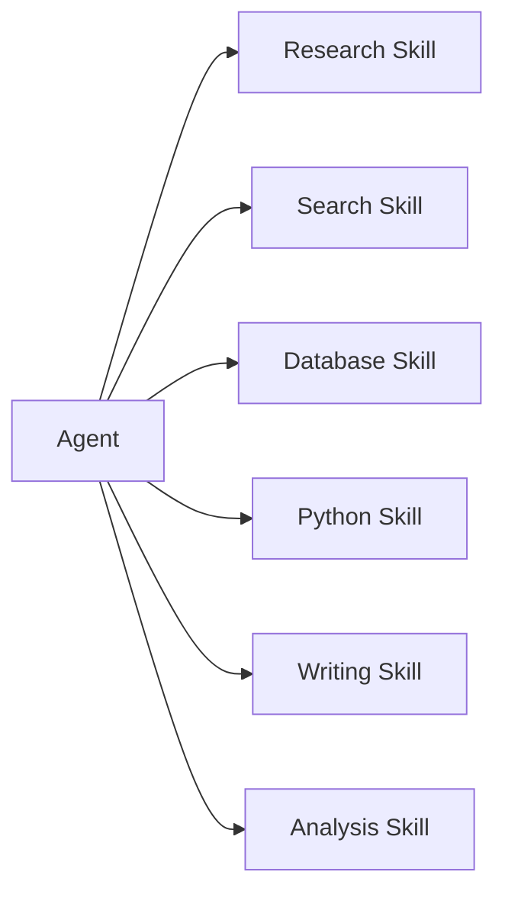
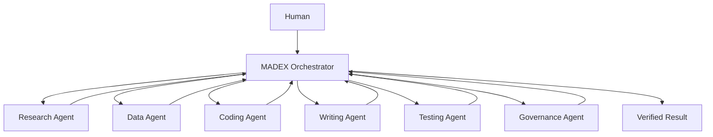
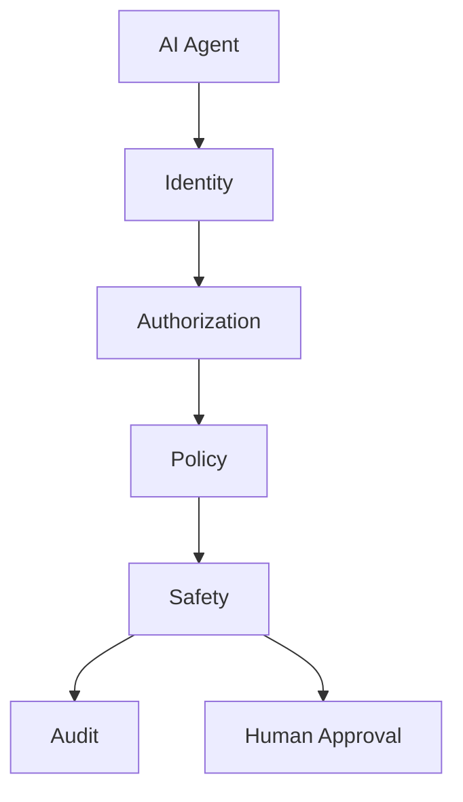
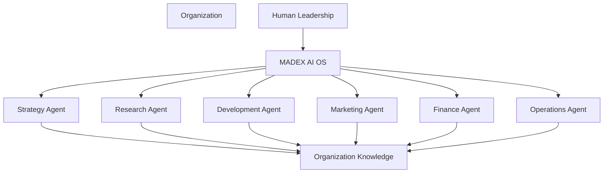
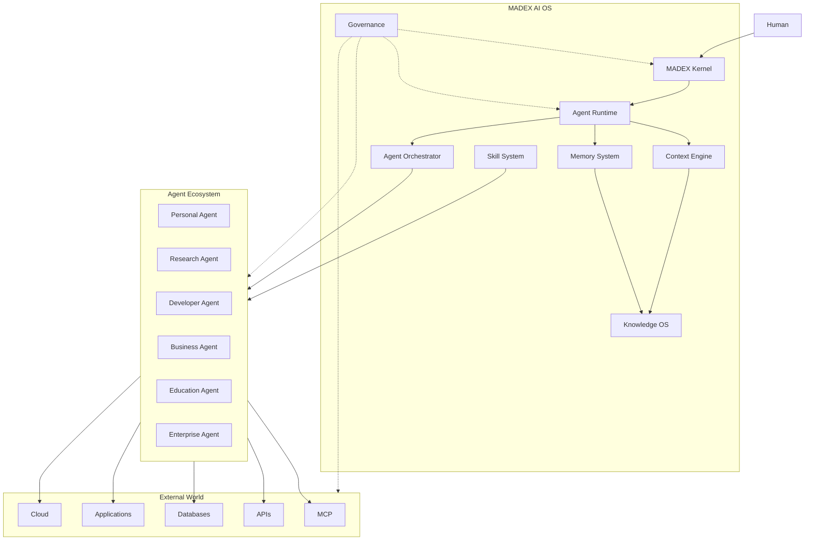

# MADEX AI OS for the Agentic Era

> **MADEX คือ AI Operating System ที่ออกแบบมาเพื่อสร้าง ควบคุม เชื่อมต่อ และบริหาร AI Agents ให้สามารถทำงานเป็นระบบเดียวกัน**

แนวคิดหลักคือ

**Human → Goal → Agent → Intelligence → Action → Result**

ไม่ใช่แค่

**Prompt → LLM → Answer**

---

## 1. Agentic Era Architecture

สถาปัตยกรรมระดับสูงสามารถแบ่งออกเป็น 5 ชั้น



### 1. Agentic Application Layer

เป็นชั้นที่ผู้ใช้มองเห็น

เช่น

* AI Assistant
* Research Agent
* Coding Agent
* Business Agent
* Education Agent
* Customer Service Agent
* Enterprise Agent

---

## 2. Agent Orchestration Layer

เป็น **สมองด้านการควบคุม Workflow**

ทำหน้าที่

* Task Decomposition
* Agent Routing
* Workflow Management
* Agent Coordination
* Parallel Execution
* Sequential Execution
* Retry
* Recovery
* Human Approval

ตัวอย่าง

```text
User Goal
   ↓
Orchestrator
   ↓
Research Agent
   ↓
Analysis Agent
   ↓
Writer Agent
   ↓
Reviewer Agent
   ↓
Final Output
```

---

# 3. Agent Intelligence Layer

ชั้นนี้เป็นความสามารถด้าน Intelligence



ประกอบด้วย

* Reasoning
* Planning
* Decision Making
* Reflection
* Self-Correction
* Verification
* Evaluation

ดังนั้น Agent ไม่ควรมีแค่ `generate()` แต่ควรมีวงจรการทำงาน

```text
reason()
plan()
act()
observe()
verify()
reflect()
```

---

# 4. Context & Memory Layer

นี่เป็นส่วนสำคัญมากของ Agentic System

เพราะ Agent ที่ไม่มี Memory จะเหมือน “พนักงานที่จำอะไรไม่ได้”

สามารถแบ่ง Memory เป็น



### Working Memory

ข้อมูลที่ Agent กำลังทำอยู่

### Episodic Memory

ประสบการณ์ที่ผ่านมา

### Semantic Memory

ความรู้และข้อเท็จจริง

### Procedural Memory

วิธีการทำงานหรือ Skill

---

# 5. Context Engineering

Agentic Era ทำให้ **Context Engineering** มีความสำคัญมากกว่า Prompt Engineering

เพราะ Agent ต้องตอบคำถามว่า

> “ตอนนี้ฉันควรรู้อะไร?”

ไม่ใช่เพียง

> “ฉันควรตอบว่าอะไร?”

สามารถสร้าง Context Pipeline ได้ดังนี้



นี่สามารถต่อยอดเป็น **MADEX Context Engine** ได้โดยตรง

---

# 6. MADEX Agent Runtime

MADEX Agent Runtime ควรเป็นหัวใจของระบบ



Runtime จะควบคุม Agent ตั้งแต่

**Create → Initialize → Execute → Observe → Verify → Complete**

---

# 7. MADEX Skill System

Skill เป็นอีกหนึ่งองค์ประกอบที่สำคัญมาก

Agent ไม่ควรต้องเรียนรู้ทุกอย่างใหม่ทุกครั้ง

แต่สามารถติดตั้ง Skill ได้



จึงเกิดแนวคิด

> **Agent = Intelligence + Skills + Tools + Memory**

---

# 8. Skill กับ Tool ต่างกันอย่างไร?

นี่เป็นจุดที่ MADEX สามารถสร้าง Model ของตัวเองได้

### Tool

คือสิ่งที่ Agent **เรียกใช้งาน**

เช่น

```text
Search API
Database
Python
Browser
Email
File System
MCP
```

### Skill

คือ **ความสามารถในการทำงาน**

เช่น

```text
Research
Data Analysis
Software Development
Report Writing
Financial Analysis
Teaching
```

ดังนั้น

```text
Skill
   ↓
Knowledge + Procedure
   ↓
Tool
   ↓
Execution
```

---

# 9. Multi-Agent Operating Model

เมื่อ Agent จำนวนมากทำงานร่วมกัน เราต้องมีระบบกลาง



นี่ทำให้ MADEX ก้าวจาก

**Agent Framework**

ไปสู่

**Agent Operating Platform**

---

# 10. Agent-to-Agent Communication

Multi-Agent ต้องสามารถสื่อสารกันได้

ตัวอย่าง

```text
Research Agent
      ↓
"Research completed"
      ↓
Analysis Agent
      ↓
"Analysis completed"
      ↓
Writer Agent
      ↓
"Draft completed"
      ↓
Reviewer Agent
      ↓
"Approved"
```

จึงต้องมี

* Agent Identity
* Agent Message
* Task ID
* Context ID
* Session ID
* Capability
* Permission
* Result
* Status

---

# 11. Agent Governance

เมื่อ Agent สามารถ “ลงมือทำ” ได้ ความเสี่ยงก็เพิ่มขึ้น

ดังนั้น Agentic Era ต้องมี Governance ตั้งแต่ต้น



หลักการสำคัญคือ

> **Agent ต้องมีสิทธิ์เท่าที่จำเป็นต่อการทำงาน**

ไม่ใช่ให้ Agent เข้าถึงทุกอย่าง

---

# 12. Agentic Security

Security Model จะเปลี่ยนจาก

> User Authentication

ไปสู่

> **Human + Agent + Tool + Data Authorization**

ตัวอย่าง

```text
Human
  ↓
Agent Identity
  ↓
Permission
  ↓
Tool Access
  ↓
Data Access
  ↓
Action
  ↓
Audit
```

ทุก Action สำคัญควรตรวจสอบย้อนหลังได้

---

# 13. Agent Evaluation

Agentic System ไม่สามารถวัดด้วยแค่

> “คำตอบถูกหรือไม่?”

แต่ต้องวัดทั้งกระบวนการ


ตัวชี้วัด เช่น

* Task Success Rate
* Planning Accuracy
* Tool Accuracy
* Cost
* Latency
* Reliability
* Hallucination Rate
* Recovery Rate
* Human Intervention Rate

---

# 14. จาก Agentic System → Agentic Organization

นี่คือระดับที่น่าสนใจที่สุด



แนวคิดนี้เรียกว่า

# **Agentic Organization**

องค์กรที่ไม่ได้ใช้ AI แค่เป็นเครื่องมือ แต่มี AI Agents เป็นส่วนหนึ่งของโครงสร้างการทำงาน

---

# 15. MADEX Vision

ดังนั้น Vision ของ MADEX สามารถกำหนดเป็น

> **MADEX — The Operating System for the Agentic Era**

หรือภาษาไทย

> **MADEX — ระบบปฏิบัติการสำหรับยุคแห่ง AI Agents**

และมี Mission ว่า

> **สร้างโครงสร้างพื้นฐานสำหรับ AI Agents ที่สามารถคิด วางแผน ใช้เครื่องมือ จัดการความรู้ จดจำประสบการณ์ ทำงานร่วมกัน และดำเนินงานภายใต้ระบบ Governance เดียวกัน**

---

## 16. MADEX Core Architecture

ภาพรวมสุดท้ายสามารถกำหนดเป็น Architecture หลักได้ดังนี้



### แก่นของ MADEX

**Kernel**
ควบคุม Core AI System

**Runtime**
ทำให้ Agent สามารถทำงานได้

**Context Engine**
จัดการข้อมูลที่ Agent จำเป็นต้องรู้

**Memory**
ทำให้ Agent จดจำ

**Knowledge OS**
จัดการความรู้

**Orchestrator**
จัดการ Multi-Agent

**Skill System**
เพิ่มความสามารถให้ Agent

**Governance**
ควบคุม Security, Policy, Permission และ Audit

---

## 17. The Big Shift

ท้ายที่สุด Agentic Era อาจสรุปได้ด้วย 3 การเปลี่ยนแปลงใหญ่

```text
SOFTWARE ERA
Human → Software → Result

GENERATIVE AI ERA
Human → AI → Content

AGENTIC ERA
Human → Goal → Agent → Actions → Result
                         ↑
              Memory / Knowledge
                         ↑
                  Tools / APIs
                         ↑
                 Other Agents
```

และถ้า MADEX ทำสำเร็จ เป้าหมายจะไม่ใช่เพียง

> **“สร้าง AI Agent ให้เก่งขึ้น”**

แต่คือ

> **“สร้างระบบที่ทำให้ AI Agents จำนวนมากสามารถทำงานเป็นองค์กรดิจิทัลได้”**

นี่จะทำให้ **MADEX AI OS** มีตำแหน่งทางแนวคิดที่ชัดเจนมากขึ้นว่าเป็น **Agentic Infrastructure / Agent Operating System** มากกว่า Framework ทั่วไปสำหรับสร้าง AI Agent.
